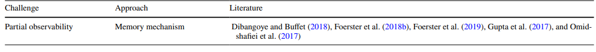

# Deep Reinforcement Learning for Multi-Agent Systems on the Example of Chess 

## Content of first project (Grundprojekt)
The goal of the first project is threefold

 - Research current challenges of multi-agent reinforcement learning (MARL) scenario and come up with a concept for an experiment setup 
 - Implement the designed experiment setup using a simple reinforcement algorithm as proof of concept 
 - Generate a frequency distribution of the performed actions for each individual agent (individual actions spaces) from past games of the LichessAPI. Visualize the results.  

### 1. Current Challenges in the Context of MARL
Most of the challenges that exist in reinforcement learning (RL) also appear in MARL. The following table, taken from [1], gives a short overview over these challenges and recent approches.

(source: [1])

For example non-stationarity appears, as soon as multiple learners share an environment. Each is perform their own action, thus all other actions besides their own is considered a dynamic effect leading to non-stationarity of the environment. 

Communications models can be used to exchange information about chosen actions or local information about the shared environment. To do so, the agents need a common language and a protocol for the communication. 

Furthermore in for example a cooperative setup the agent have to coordinate themselves, by for example splitting the workload or exploring different areas. This also falls back on communication to exchange newly gained knowledge. 

Another factor, that also is a widely spread challenge in RL with a single action, is the credit assignment problem, as it is often impossible to assess which action let to success. This is even more complicated in multi agent setup, as not only the individual actions but also each agent takes part into the global solution. 

Furthermore scalability is a challenge when state or action space become very large or continuous. Often this is also an issue in setups with multiple agents, even though it is possible to split action spaces and state spaces into individual agents, that might reduce the overall complexity.

Other problems also include the challenge of sparse rewards, the exploration-exploitation dilemma [2], low sample efficiency [3], reward function design [4] and as in most machine learning setting hyperparameter tuning. 

## 2. The Experiment Setup
! TODO ! . 

Experiments are set to take place in a chess environment. This choice has been made for the following reasons: 
- Agents: 
  - the number of agents is clearly limited to the number of pieces per team
  - agents have different action spaces (per type) and also different frequency distributions depending on their positions, which is an interesting setting 
  - the action space is discrete and small per agent. The maximum of actions for one piece is XX 
- Environment 
  - games are episodic. They have a defined end under certain termination criteria
    - XX 
  
  

It is an interesting challenge to combine a local and a global component of the experiment setup. On the one hand all agents have to make a local choice, of which action they would perform. On the other hand a global agent has to choose which of these actions is the best and will thus be performed.

## Using the experimentation setup 
! TODO ! . 

## Visualization of the frequency distribution 
! TODO ! . 

----------------

## References
- [1]: Gronauer, S., & Diepold, K. (2022). Multi-agent deep reinforcement learning: a survey. Artificial Intelligence Review, 1-49.
- [2] Nguyen, T. T., Nguyen, N. D., & Nahavandi, S. (2020). Deep reinforcement learning for multiagent systems: A review of challenges, solutions, and applications. IEEE transactions on cybernetics, 50(9), 3826-3839.
- [3] Ye, Z., Chen, Y., Jiang, X., Song, G., Yang, B., & Fan, S. (2022). Improving sample efficiency in multi-agent actor-critic methods. Applied Intelligence, 1-14.
- [4] Qian, J., Weng, P., & Tan, C. (2023). Learning Rewards to Optimize Global Performance Metrics in Deep Reinforcement Learning. arXiv preprint arXiv:2303.09027.